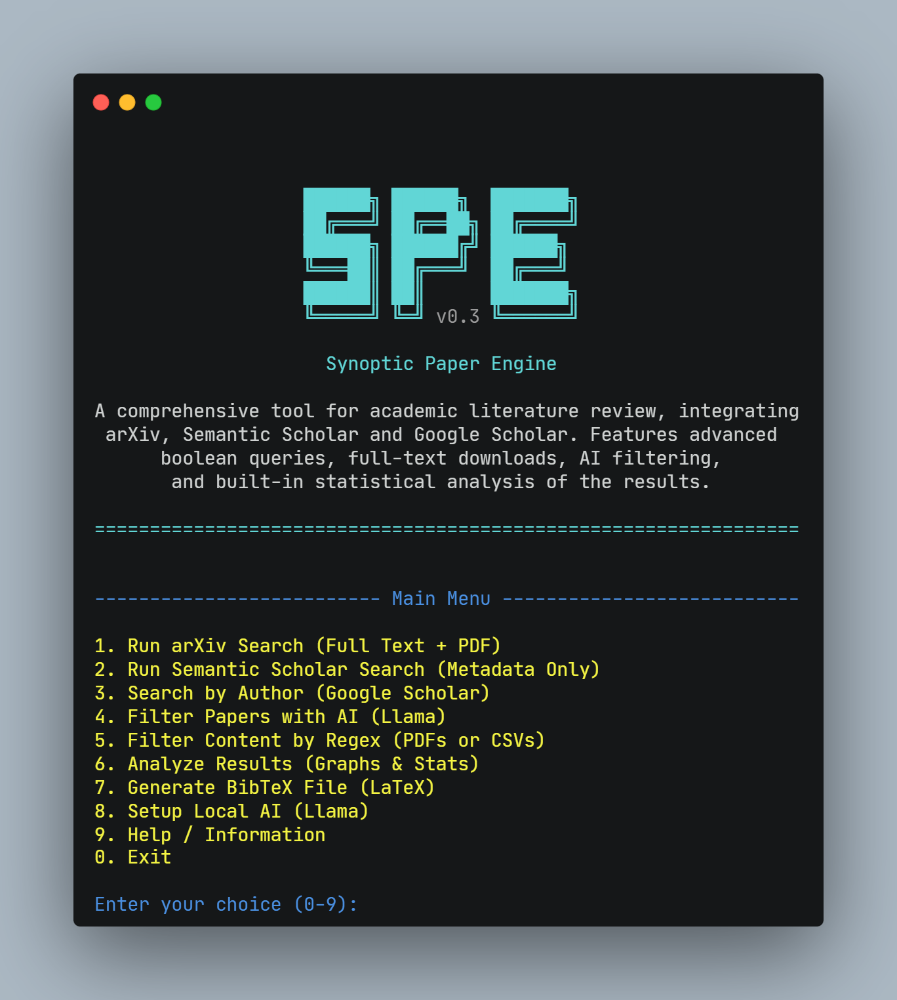

# Synoptic Paper Engine (SPE)

**Synoptic Paper Engine** is a command-line interface (CLI) tool designed to automate systematic literature reviews. It integrates multi-source bibliographic retrieval, intelligent query parsing, and advanced filtering pipelines using local Large Language Models (LLMs) and full-text proximity analysis.

The system is engineered to streamline the workflow of gathering, filtering, and analyzing large volumes of academic literature.




-----

## 🚀 Core Features

### 1\. Multi-Source Retrieval

The engine connects to three distinct academic repositories:

  * **ArXiv:** Performs full-text retrieval. It automatically downloads PDF files and renames them based on the article title for local organization.
  * **Semantic Scholar:** Utilizes the API for high-volume metadata retrieval, ideal for broad bibliometric scans.
  * **Google Scholar (Author Search):** Retrieves comprehensive publication lists for specific researchers using their unique **Author ID**, bypassing common IP restrictions associated with name-based scraping.

### 2\. Advanced Query Parsing

SPE features a custom-built query engine that handles complex Boolean logic.

  * **Logic Expansion:** Automatically parses nested parentheses and performs a Cartesian expansion of `OR` groups into atomic API requests (e.g., `(A OR B) AND C` becomes `A AND C` and `B AND C`).
  * **Syntax Support:** Full support for `AND`, `OR`, `NOT` operators.
  * **Exact Phrase Matching:** Utilizes asterisks (e.g., `*Machine Learning*`) to denote exact multi-word tokens, preventing unwanted token splitting.

### 3\. Hierarchical Filtering Pipelines

Unlike standard keyword searches, SPE offers two post-processing filtration layers:

  * **🤖 Semantic AI Filter (Local LLM):**

      * Leverages quantized local models (Llama 3 or Qwen) to analyze titles and abstracts.
      * Classifies papers based on user-defined personas and qualitative criteria (e.g., "Must include experimental validation").
      * Operates entirely offline, ensuring data privacy.

  * **📄 Full-Text Content Filter (Ranking System):**

      * Scans the full text of downloaded PDFs (via `pypdf`).
      * Implements a **Relevance Ranking Algorithm** based on term presence and **Proximity Search**.
      * Categorizes files into `High_Relevance` (terms appear in close proximity), `Medium_Relevance` (all terms present), and `Low_Relevance` folders.

### 4\. Statistical Analysis & Deduplication

  * **Consolidation:** Merges results from different search batches and sources.
  * **Deduplication:** Identifies and removes duplicate entries using title normalization logic.
  * **Reporting:** Generates CSV reports in the `log/` directory, detailing publication trends over time, author frequency, and citation metrics.

-----

## 🔧 Installation

The package can be installed directly from the repository using `pip`. A virtual environment (venv or conda) is recommended.

### Prerequisites

  * Python 3.10 or higher.
  * Git.

### Install via Command Line

```bash
pip install git+https://github.com/oi-silva/synoptic-paper-engine.git
```

## 🔄 Updating the Tool

To update your installation to the latest version from the repository, you need to re-run the installation command with the `--upgrade` and `--no-cache-dir` flags.

```bash

pip uninstall synoptic-paper-engine

pip install --upgrade --no-cache-dir git+https://github.com/oi-silva/synoptic-paper-engine.git

```

* `--upgrade`: Tells `pip` to update the package to the newest version.

* `--no-cache-dir`: This is crucial. It forces `pip` to fetch the latest code from GitHub instead of using a cached, older version.
-----

## 🖥️ Usage

To launch the interactive menu, execute the module:

```bash
python -m spe.main
```

or shorter:
```bash
spe
```

### Workflow Overview

1.  **Retrieval:** Select **Option 1** (ArXiv) or **Option 2** (Semantic Scholar) to gather data.
2.  **Filtrations:**
      * Use **Option 4** (AI Filter) for semantic screening of abstracts.
      * Use **Option 5** (PDF Content Filter) to scan full PDF texts for specific formulas or terms.
3.  **Analysis:** Run **Option 6** (Analyze Results) to deduplicate the dataset and generate final statistics.

-----

## 🔍 Query Syntax Guide

The query engine enforces strict syntax for precision.

| Operator | Description | Example |
| :--- | :--- | :--- |
| **AND** | Intersection | `Graphene AND Properties` |
| **OR** | Union (grouping required) | `(Solar OR Wind)` |
| **NOT** | Exclusion | `NOT Review` |
| **`*...*`** | **Exact Phrase** | `*Deep Learning*` |

> **Important:** The parser treats space-separated words as implicit `AND` conditions. To search for a composite term like "Deep Learning" as a single entity, it **must** be enclosed in asterisks: `*Deep Learning*`.

-----

## ⚠️ System Requirements & Limitations

  * **LLM Model:** The AI filtering module requires downloading a model file (approx. 1GB - 4GB) upon first use. This runs on the CPU but benefits from available RAM.
  * **API Rate Limits:** While the tool implements exponential backoff strategies, aggressive querying (excessive `OR` groups) may still trigger temporary API rate limits from Semantic Scholar or ArXiv.


-----
